<div align="center">

<br>

<picture>
  <source media="(prefers-color-scheme: dark)" srcset="apps/docs/public/brand/logo-dark.svg">
  
</picture>

<h3>Quiet, precise components for React.</h3>

<p>46 accessible components · plain CSS · design tokens · server-component friendly</p>

<p>
  <a href="https://github.com/ahmetcantryk/merid/actions/workflows/ci.yml"></a>
  <a href="LICENSE"></a>
  
  
  
</p>

<p>
  <a href="#install"><b>Install</b></a> &nbsp;·&nbsp;
  <a href="#gallery"><b>Gallery</b></a> &nbsp;·&nbsp;
  <a href="#components"><b>Components</b></a> &nbsp;·&nbsp;
  <a href="#theming"><b>Theming</b></a> &nbsp;·&nbsp;
  <a href="https://meridui.dev"><b>Docs</b></a>
</p>

<br>

</div>

Merid is an accessible React component library written in **plain CSS** and a small set of **design tokens**. Hairline borders, one cool accent, soft grey trays and calm motion — so your product reads as *considered*, not decorated.

> The name comes from ***meridian*** — a thin, precise reference line.

<br>

## Why Merid

<table>
  <tr>
    <td width="50%" valign="top">
      <h4>Accessible by default</h4>
      WCAG 2.2 AA target, WAI-ARIA patterns, full keyboard support, visible focus and reduced motion. An axe suite runs on every change.
    </td>
    <td width="50%" valign="top">
      <h4>Plain CSS, your CSS wins</h4>
      One stylesheet in three cascade layers. Override anything without <code>!important</code>. No runtime styling, no build plugin.
    </td>
  </tr>
  <tr>
    <td width="50%" valign="top">
      <h4>Tokens all the way down</h4>
      Every value is a <code>--mrd-*</code> custom property with light and dark values — ship as CSS or JS via <code>@merid/tokens</code>.
    </td>
    <td width="50%" valign="top">
      <h4>Server-component friendly</h4>
      Static parts render on the server; interactive modules carry <code>"use client"</code>. Import any component straight into an RSC.
    </td>
  </tr>
  <tr>
    <td width="50%" valign="top">
      <h4>Scoped themes</h4>
      Dark mode, accent presets, density and direction — per app or per subtree. Portals inherit the scope they came from.
    </td>
    <td width="50%" valign="top">
      <h4>RTL &amp; forced colors</h4>
      Logical properties throughout, mirrored keyboard navigation, and a first-class Windows High Contrast experience.
    </td>
  </tr>
</table>

<br>

## Install

```bash
npm i @merid/react
```

```tsx
import "@merid/react/styles.css";
import { AlertDialog, Button } from "@merid/react";

export function DeleteProject({ onDelete }: { onDelete: () => void }) {
  return (
    <AlertDialog.Root>
      <AlertDialog.Trigger asChild>
        <Button variant="danger">Delete project</Button>
      </AlertDialog.Trigger>
      <AlertDialog.Content>
        <AlertDialog.Title>Delete this project?</AlertDialog.Title>
        <AlertDialog.Description>This removes all of its files. It cannot be undone.</AlertDialog.Description>
        <AlertDialog.Footer>
          <AlertDialog.Cancel>Cancel</AlertDialog.Cancel>
          <AlertDialog.Action tone="danger" onClick={onDelete}>
            Delete
          </AlertDialog.Action>
        </AlertDialog.Footer>
      </AlertDialog.Content>
    </AlertDialog.Root>
  );
}
```

One stylesheet import. No theme provider — only toasts need a <code>ToastProvider</code>.

<br>

## Gallery

<sub>Real renders from the visual regression suite. They follow your GitHub theme.</sub>

<table>
  <tr>
    <td align="center" width="50%">
      <picture><source media="(prefers-color-scheme: dark)" srcset=".github/assets/button-dark.png">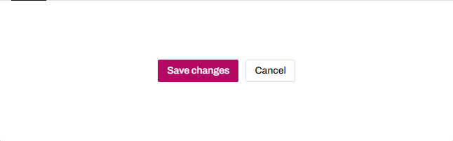</picture>
      <br><sub><b>Button</b></sub>
    </td>
    <td align="center" width="50%">
      <picture><source media="(prefers-color-scheme: dark)" srcset=".github/assets/field-dark.png">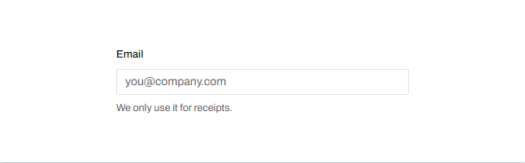</picture>
      <br><sub><b>Field</b></sub>
    </td>
  </tr>
  <tr>
    <td align="center">
      <picture><source media="(prefers-color-scheme: dark)" srcset=".github/assets/select-dark.png">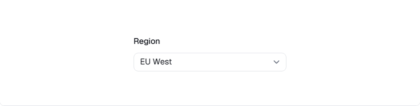</picture>
      <br><sub><b>Select</b></sub>
    </td>
    <td align="center">
      <picture><source media="(prefers-color-scheme: dark)" srcset=".github/assets/tabs-dark.png">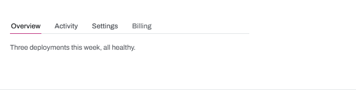</picture>
      <br><sub><b>Tabs</b></sub>
    </td>
  </tr>
  <tr>
    <td align="center">
      <picture><source media="(prefers-color-scheme: dark)" srcset=".github/assets/segmented-control-dark.png">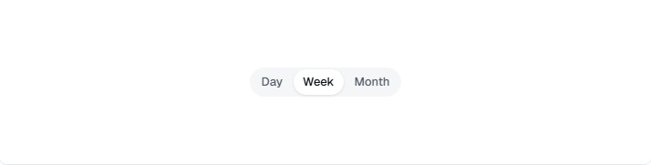</picture>
      <br><sub><b>Segmented control</b></sub>
    </td>
    <td align="center">
      <picture><source media="(prefers-color-scheme: dark)" srcset=".github/assets/switch-dark.png">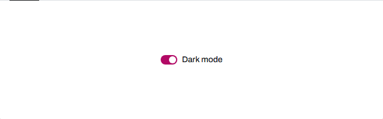</picture>
      <br><sub><b>Switch</b></sub>
    </td>
  </tr>
  <tr>
    <td align="center">
      <picture><source media="(prefers-color-scheme: dark)" srcset=".github/assets/alert-dark.png">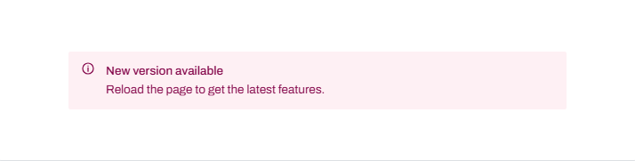</picture>
      <br><sub><b>Alert</b></sub>
    </td>
    <td align="center">
      <picture><source media="(prefers-color-scheme: dark)" srcset=".github/assets/stepper-dark.png">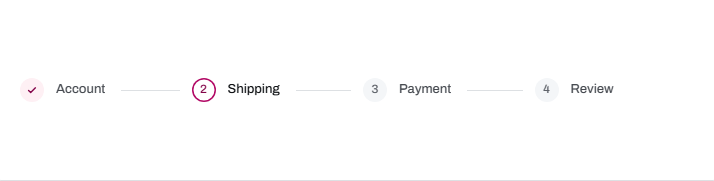</picture>
      <br><sub><b>Stepper</b></sub>
    </td>
  </tr>
  <tr>
    <td align="center">
      <picture><source media="(prefers-color-scheme: dark)" srcset=".github/assets/table-dark.png">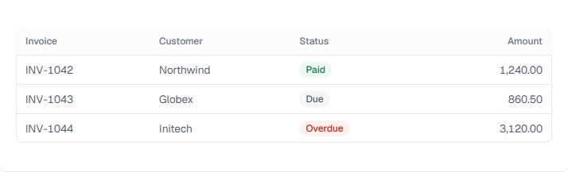</picture>
      <br><sub><b>Table</b></sub>
    </td>
    <td align="center">
      <picture><source media="(prefers-color-scheme: dark)" srcset=".github/assets/dialog-open-dark.png">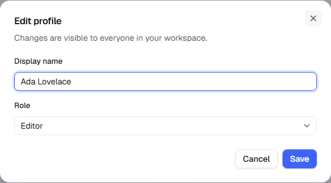</picture>
      <br><sub><b>Dialog</b></sub>
    </td>
  </tr>
</table>

<br>

## Components

| Category | Components |
| :-- | :-- |
| **Actions** | Button · IconButton · Link · DropdownMenu · SegmentedControl |
| **Forms** | Field · Label · Input · Textarea · Select · NativeSelect · Checkbox · Radio · Switch |
| **Overlays** | Dialog · AlertDialog · Drawer · Popover · Tooltip · Toast · Portal |
| **Navigation** | Tabs · Breadcrumb · Pagination · Stepper · SidebarNav |
| **Feedback** | Alert · Progress · Spinner · Skeleton · EmptyState · Badge |
| **Data display** | Table · Card · Avatar · Accordion · Code · Kbd |
| **Layout** | Container · Section · Stack · Grid · Separator |
| **Typography** | Heading · Text · VisuallyHidden |

Every component has a page with live examples, props and keyboard notes at **[meridui.dev](https://meridui.dev)**.

<br>

## Theming

Themes are plain attributes, so they scope to any subtree.

```tsx
<div data-theme="dark" data-accent="violet" data-density="compact" dir="rtl">
  {/* everything in here, including portaled overlays, follows */}
</div>
```

Need to go deeper? Override tokens in your own CSS — it always wins over Merid's layers:

```css
:root {
  --mrd-radius-md: 8px;
  --mrd-radius-card: 12px;
}
```

<br>

## Packages

| Package | Description |
| :-- | :-- |
| [`@merid/react`](packages/react) | React components, stylesheet and bundled Geist fonts |
| [`@merid/tokens`](packages/tokens) | Design tokens as CSS custom properties and typed JS |

<br>

## Works with

**Next.js** (App Router & RSC) · **Vite** · **React Router** · **Tailwind** · **React Hook Form** · **Zod**
&nbsp;—&nbsp; see [`examples/`](examples) for a Next.js app and a Vite dashboard.

**Browsers:** Chrome & Edge 111+ · Firefox 113+ · Safari 16.4+ &nbsp;·&nbsp; **React:** 18.2 and 19

<br>

## Development

```bash
npm install
npm run dev        # docs at http://localhost:3210
npm test           # unit + SSR
npm run test:e2e   # a11y, interactions, playground
```

Contributions are welcome — read [CONTRIBUTING.md](CONTRIBUTING.md) and the [Code of Conduct](CODE_OF_CONDUCT.md) first. Security issues go through [SECURITY.md](SECURITY.md), not public issues.

<br>

<div align="center">

<picture>
  <source media="(prefers-color-scheme: dark)" srcset="apps/docs/public/brand/mark-dark.svg">
  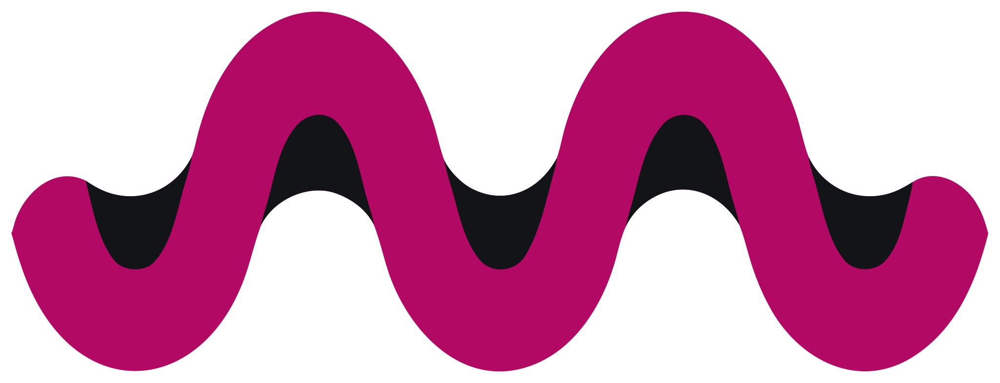
</picture>

<sub>[MIT](LICENSE) © 2026 Ahmet Can Tiryaki · Geist & Geist Mono © Vercel, bundled under the SIL OFL 1.1 — see [NOTICE](NOTICE)</sub>

</div>
